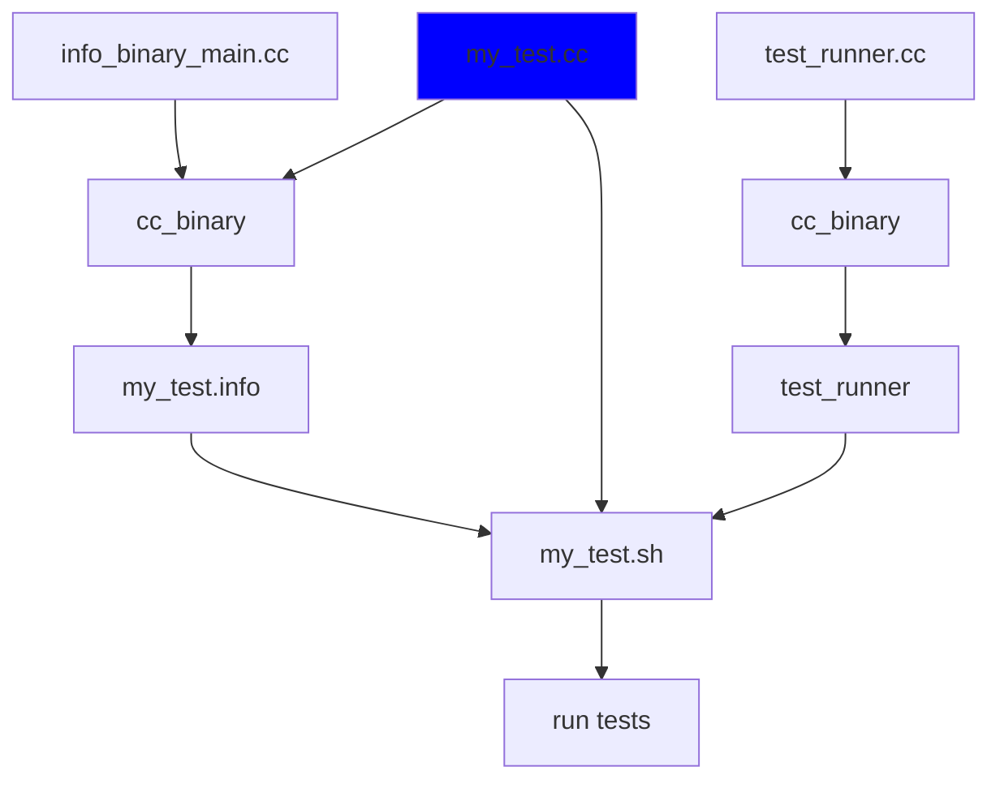

- [cc_test, but for static_assert](#cc_test-but-for-static_assert)
- [Installation](#installation)
- [Usage](#usage)
- [Detailed Documentation](#detailed-documentation)
  - [cc_comp_test](#cc_comp_test)
  - [comp_test.hh](#comp_testhh)
  - [JUnit Output (test.xml)](#junit-output-testxml)
- [Hacking/Contributing](#hackingcontributing)
- [Coming Features - Vote!](#coming-features---vote)
- [How it Works](#how-it-works)


# cc_test, but for static_assert

Unit test your C++ `static_assert()`'s in Bazel with `cc_comp_test`

`cc_comp_test` is a Bazel rule to build and run unit tests that validate static_assert behaviour.


# Installation

```py
# WORKSPACE

http_archive(
    name = "cc_comp_test",
    sha256 = "",
    strip_prefix = "cc_comp_test-1.0.0",
    url = "https://www.github.com/dave-hagedorn/cc_comp_test/archive/1.0.0.zip",
)
```

# Usage

Write your test cases in any source file

```c++
// numbers_test.cc

#include <type_traits>

#include "comp_test/comp_test.hh"

template <typename T>
auto picky_to_string(T &&value) {
    static_assert(std::is_integral_v<T> || std::is_floating_point_v<T>, "only numbers are supported");

    if constexpr (std::is_integral_v<T>) {
        static_assert(std::is_unsigned_v<T>, "signed types not supported");
    }

    return std::to_string(value);
}

// Test cases can be grouped inside test suites
// Test suites themselves can be nested inside other test suites
TEST_SUITE("numbers") {

    TEST_COMP_ASSERT("to_string", "only allows numbers", "only numbers are supported") {
        auto value = "invalid value";

        picky_to_string(value);
    }

    // Designated initializer notation can also be used, allowing for "named" arguments
    // You need -std=c++20  for this, otherwise you may see compile warnings
    // Clang/GCC also support this as an extension pre-C++20
    TEST_COMP_ASSERT(.thing="to_string", .will="does not allow signed types", .assert_with="signed types not supported") {
        picky_to_string(-3);
    }
}
```

Use the cc_comp_test rule to define a test target using these test cases

```py
# BUILD.bazel

load("@cc_comp_test:cc_comp_test.bzl", "cc_comp_test")

cc_comp_test(
    name = "testing_numbers"
    # src can be omitted - <name>.cc will be used
    src = "testing_numbers.cc",
    # any normal cc_* deps are supported - cc_library(), etc.
    deps = [
        "//needed_lib",
    ]
)
```

```bash
bazel test :testing_numbers
```

# Detailed Documentation

## cc_comp_test

| parameter | meaning                                                                                                                                                           |
|-----------|-------------------------------------------------------------------------------------------------------------------------------------------------------------------|
| src       | Source file containing your test cases.  Optional - `<name>.cc` is assumed if `src` is not defined                                                                |
| deps      | any deps required to compile your test - your lib under test, other libs, etc.  Usually other cc_library()'s, but any rule with a provider of `CcInfo` is allowed |

## comp_test.hh

Supported test definitions

| name                                       | meaning                                                                                                                        |
|--------------------------------------------|--------------------------------------------------------------------------------------------------------------------------------|
| TEST_SUITE(name)                           | Use to group test cases.  Can be nested.  Symbols defined within a `TEST_SUITE` are scoped to that suite and any nested suites |
| TEST_COMP_ASSERT(thing, will, assert_with) | Define a test case with code that must fail a `static_assert` as `static_assert(<evaluate-to-false>, "assert_with")`           |

Most test functions/macros accept named arguments as C++20 designated initializers.  This seems to work OK with clangd-based completion so I decided to kee it.


## JUnit Output (test.xml)

Each test run will emit a test.xml in JUnit format, including some extra attributes Bazel seems to like to add.

Each case can pass, fail, or error, with the meaning of this depending on the test case type

| test case type   | pass                                                        | fail                                                | error                                   |
|------------------|-------------------------------------------------------------|-----------------------------------------------------|-----------------------------------------|
| TEST_COMP_ASSERT | compilation failed with the expected `static_assert` message | compilation succeeded - `static_assert` did not fire | compilation failed for any other reason |


# Hacking/Contributing

If you use VSCode and are OK to work in a [Dev Container](https://code.visualstudio.com/docs/remote/containers), this is the recommended approach.

As usual just open this folder in VSCode and when prompted to open inside a Dev Container.

The recommended extensions such as clangd for code navigation will be installed.

As much as possible workspace settings are configured in `.vscode/settings.json` rather than `.devcontainer/devcontainer.json`, this way settings are applied regardless of
whether this workspce is open inside a Dev Container.


# Coming Features - Vote!

https://github.com/apex/gh-polls#about

[](https://api.gh-polls.com/poll/01G6X5273KW1PPR48JG522SYYR/a/vote)
<br/>
[](https://api.gh-polls.com/poll/01G6X5273KW1PPR48JG522SYYR/b/vote)
<br/>
[](https://api.gh-polls.com/poll/01G6X5273KW1PPR48JG522SYYR/c/vote)

This is currently focused on static_assert statements, but will be expanded to support additional test cases:

- [ ] Other forms of "static assert" - such as `throw` in a constexpr context
- [ ] Generic "it just compiles" test case
- [ ] Generic "must not compile" test case (do not validate type of assertion or its message)
- [ ] Parameterized tests - still TBD - but ability to run a test case across multiple types and/or compile-time values (somehow)


# How it Works

Each TEST_SUITE is just a namespace


There are four pieces that go into each cc_comp_test build:

1.  Your unit test - ex, `test.cc`
1.  The comp test library `lib:comp_test` - this provides TEST_SUITE, TEST_COMP_ASSEERT, etc.
1.  An "info binary" that is run at test execution to provide info about the test cases in `test.cc`: `info_binary:info_binary_main`
1.  A test runner `test_runner:test_runner` that is run at test time to execute the test cases in test.cc - as reported by `info_binary`

At build time, `cc_comp_test`:

* Builds `test.cc` and `info_binary:info_binary_main` into the output info binary `<name>.info`
* Builds test runner `test_runner:test_runner` as output file `test_runner`
* Generates a small wrapper around `test_runner`, `test.sh` - this just encapsulates args and info needed to later invoke `test_runner`

At test execution, `test_runner`:

* Invokes `<name>.info` to get needed info about the test cases defined in `test.cc`
* For each test case, compiles `test.cc` with that specific test case enabled, ensuring any required deps from `cc_comp_test` as well as the implicit dep `lib:comp_test` are provided during compilation
  * Note - this is a compile only step (`-c`), nothing is linked or run
* Interprets the result of the compilation - whether the compilation failed with the required static_assert, failed for unexpected reasons, compiled when it should not have, etc.
* Emits a JUnit result file test.xml - this follows the JUnit spec and also adds some extra attributes Bazel seems to use

To allow this, the runfiles for the test runner contain all public headers of any deps listed in your `cc_comp_test` and also `lib:comp_test`,
as well as all of the files defined by the `cc_toolchain` being used.  These are required as test execution literally involves
compiling your `test.cc`, so all required dependencies and toolchain files must be present during test execution.


Assuming your tests are written in `my_test.cc` and you have defined the tests as

```python
cc_comp_test(
    name = "my_test",
)
```

`test_runn

`my_test.cc` and `info_binary_main.cc` are built into the info binary my_test.info (using cc_binary)

This outputs info about the test cases defined in my_test.cc so they can be run


2.  `test_runner.cc`



wrapped in template function
instantiate function per case
test runner compiles each case with this
info binary compiles your test cases to binary and outputs info about these fo test runner
needs chart/diagram
